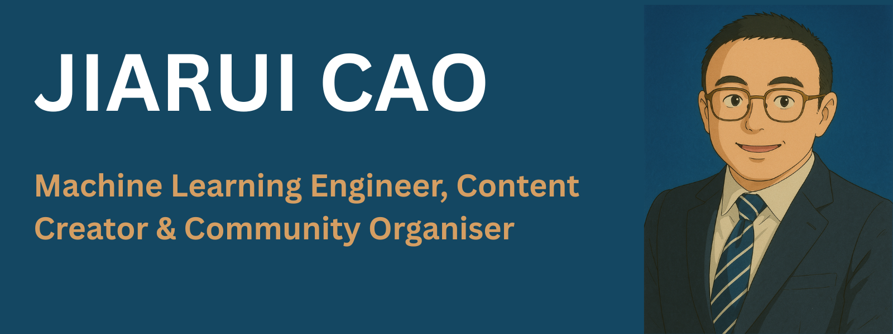

## Hi I'm Jiarui 👋

Welcome to my github page! 

Hi there, my name is Jiarui (it pronouce as "Jah-Ray", with the "J" as in "jam", and "Ray" like the English name 😁). 

#### Day Job

I am a ML engineer / quant developer lead at a Bulge Bracket bank, where I led a team of engineers to develop intenral frameowrks for model development, implementation and deployment. We also build internal analytical tools to support variaous areas of the business.  

#### Community Organiser

I am actively involved in different AI/ML communities in London and UK. 

I am organising [PyData London Meetup](https://www.meetup.com/pydata-london-meetup/). You can submit your talk at this [link](https://london.pydata.org/submit-a-talk/).

I am also volunteering the annual [PyData London Conference](https://pydata.org/london2025/home). 

I am also part of these communities: 

- [China-Britain Artificial Intelligence Association (CBAIA)](https://www.cbaia.org.uk/en/)
- [Warwick Finance Professional Network (WFPN)](https://www.linkedin.com/groups/2098432/) 

#### Blogs 
I write things in 

- My [LinkedIn Post](https://www.linkedin.com/in/jiaruicao/), for short ideas/notes. 
- My [personal website](https://jiaruicao.github.io/), for longer blogs. 

#### Open Source

From various envents from [PyData](https://pydata.org/) and [NumFocus](https://numfocus.org/), I am deeply attracted by and involved in the open source community and making my initial steps to contribute to them. Check my github contributions in this page. 😄

#### Educational Background 

Back in 2016, I finished my PhD in [Mathsmatics at Warwick University](https://warwick.ac.uk/fac/sci/maths/). My supervisor were [Stefan Grosskinsky](https://stefangrosskinsky.com/) and [Paul Chleboun](https://warwick.ac.uk/fac/sci/statistics/staff/academic-research/chleboun/). 

My reaserch was in the area of complex systems. Where I have investigated certain types of interacting particle systems. You can find my thesis here. 

I also has a M.Sc in Financial Maths and a B.Sc in statistics. So, I was pretty much trained as a mathematician. 

 
## Find me around the web 🌎:

- Sharing updates on [LinkedIn](https://www.linkedin.com/in/jiaruicao/)
- More blogs and thoughts on [Personal Website](https://jiaruicao.github.io/)

<!--
**jiaruicao/jiaruicao** is a ✨ _special_ ✨ repository because its `README.md` (this file) appears on your GitHub profile.

Here are some ideas to get you started:

- 🔭 I’m currently working on ...
- 🌱 I’m currently learning ...
- 👯 I’m looking to collaborate on ...
- 🤔 I’m looking for help with ...
- 💬 Ask me about ...
- 📫 How to reach me: ...
- 😄 Pronouns: ...
- ⚡ Fun fact: ...
-->
